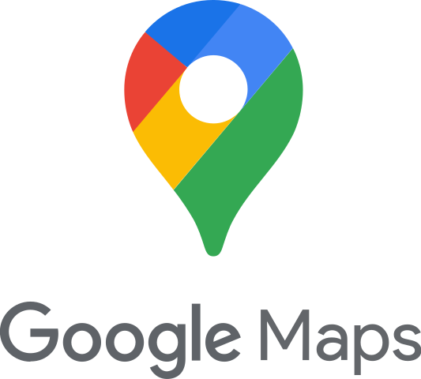
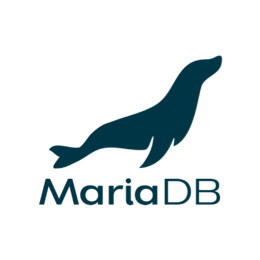
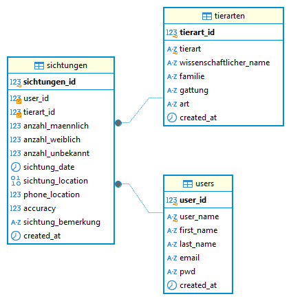

## App zur Erfassung von Wildtiersichtungen

---

## Inhalt

* Idee
* Programmiersprachen und Frameworks
* Prototyp
* Challenges
* Ausblick
* Acknowledgements
* Links

Note:
kurz den inhalt vorstellen

---

## Idee

----

Das Kernelement von jedem <span style="display: block;"></span>Geo-Informatik-Projekt


<span style="font-size: 0.4em;">*Abbildung: Generiert mit - DALL-E*</span>

----

Möglichkeiten


<span style="font-size: 0.4em;">*Abbildung: Generiert mit - DALL-E*</span>

----

Das will ich auch können!


<span style="font-size: 0.4em;">*Abbildung: Generiert mit - DALL-E*</span>

----

WildTierSichtungsApp


<span style="font-size: 0.4em;">*Abbildung: Generiert mit - DALL-E*</span>

---

## Programmiersprache und Frameworks

----

### Frontend


<span style="font-size: 0.4em;">*Abbildung: von <a href="https://github.com/ionic-team/ionic-framework" target="_blank">https://github.com/ionic-team/ionic-framework</a>*</span>

Note:
Das Frontend wurde mit dem **Ionic Framework** entwickelt.  
Ionic ermöglicht die Erstellung von Cross-Platform-Apps für iOS und Android.  
Es basiert auf **HTML, CSS und JavaScript**, 
wobei **TypeScript** für eine bessere Codequalität und Typensicherheit sorgt.

----

### Backend


<span style="font-size: 0.4em;">*Abbildung: <a href="https://go.dev/blog/go-brand" target="_blank">https://go.dev/blog/go-brand</a>*</span>

Note:
Das Backend wurde in **Go (Golang)** programmiert.  
Go ist effizient, schnell und eignet sich hervorragend für REST-APIs.  
Es sorgt für **skalierbare und performante Anwendungen**.

----

### WebMap



<span style="font-size: 0.4em;">*Abbildung: <a href="https://en.m.wikipedia.org/wiki/File:Google_Maps_Logo_2020.svg" target="_blank">https://en.m.wikipedia.org</a>*</span>

Note:
Die **Google Maps API** visualisiert die Wildtiersichtungen auf einer Karte.  
Sie bietet Funktionen wie Marker, Routenplanung und Geocoding.

----

### Datenbank



<span style="font-size: 0.4em;">*Abbildung: <a href="https://github.com/mariadb-corporation" target="_blank">https://github.com/mariadb-corporation</a>*</span>

Note:
Die Daten werden in **MariaDB** gespeichert.  
MariaDB ist schnell, zuverlässig und eignet sich für relationale Datenbanken.  
Hier liegen die Wildtiersichtungen und weitere App-Daten.

---

## Prototyp

----

Logo


<span style="font-size: 0.4em;">*Abbildung: Logo - Designed by Annalisa Berger*</span>

----

Datenbankstruktur



<span style="font-size: 0.4em;">*Abbildung: Kreiert mit DBeaver*</span>

----

QR-Code, um die App zu installieren
<br>


----

Demo

<div style="border: 1px solid black; padding: 1px; display: inline-block;">
    <iframe src="https://wildtierapp.juliankraft.ch/app/" width="95%" height="500px" allow="geolocation"></iframe>
</div>

----

Data View

<iframe src="https://wildtierapp.juliankraft.ch/inframe" width="100%" height="500px"></iframe>

----

Beispiel für Datenbezug mit Python:

```python
import mysql.connector
import json

# Lade die Datenbankverbindungsdetails aus der JSON-Datei
with open('./db_setup/db_config.json', 'r') as config_file:
    config = json.load(config_file)

# Verbindung zur MariaDB-Datenbank herstellen
connection = mysql.connector.connect(
    host=config['host'],
    port=config['port'],
    user=config['user'],
    password=config['password'],
    database=config['database']
)

# Funktion, um Daten aus der Datenbank abzurufen
def get_data(statement):
    cursor = connection.cursor()
    try:
        cursor.execute(statement)
        data = cursor.fetchall()
        return data
    except mysql.connector.Error as e:
        print(f"Fehler beim Abrufen der Daten: {e}")
    finally:
        cursor.close()

# Datenbeispiel abrufen

data = get_data("SELECT * FROM sichtungen;")
```

---

## Challenges

* Neue Programmiersprachen
* Neue Frameworks
* Serverkonfiguration
* Datenbankkonfiguration
* Login und Authentifizierung

---

## Ausblick

* Code besser strukturieren und kommentieren
* Mehr Funktionen hinzufügen:
    * Bilder hochladen bzw. aufnehmen
    * Dateneinsicht in der App ermöglichen
    * Einträge bearbeiten und löschen
* Design verbessern
<br>
* Zuerst aber – eine tatsächliche Anwendung finden

---

## Acknowledgements
<br>
Danke an Ramon Ott für die Unterstützung bei der Umsetzung dieses Projekts.
<br><br>
Danke an Annalisa Berger für das Design des Logos.

---

## Links

Presentation:<br>
<a href="https://wildtierapp.juliankraft.ch/presentation" target="_blank">wildtierapp.juliankraft.ch/presentation</a>

Prototyp:<br>
<a href="https://wildtierapp.juliankraft.ch/app/" target="_blank">WebApp - Installation</a><br>
<a href="https://wildtierapp.juliankraft.ch/" target="_blank">Datensichtung</a>

GitHub Repos:<br>
<a href="https://github.com/juliankraft/WildtierSichtungsApp_front" target="_blank">Frontend</a><br>
<a href="https://github.com/juliankraft/WildtierSichtungsApp_back" target="_blank">Backend</a>
