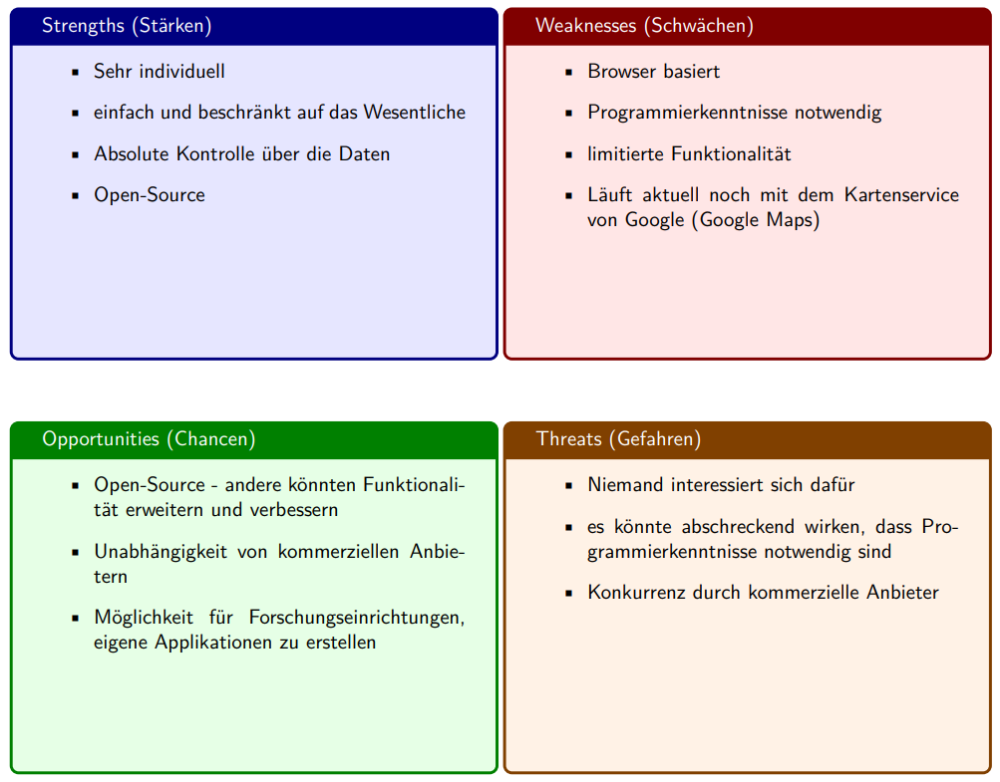
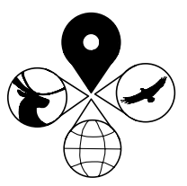

## Inhalt

* Idee
* Entstehung
* Prototype

---

## Idee

----

Wie erheben wir Geodaten im Feld?

----

Wie könnten wir Geodaten im Feld erheben?

----

Geodaten Erhebung mit Smartphone App

### Was ist wichtig?

----

Einfachheit der App - nur das absolut nötigste

----

Datenhoheit - Die Daten sollen selbst verwaltet werden

----

Wiederverwendbarkeit - das Problem einmal lösen und immer wieder verwenden!

----

### Unsere Lösung

Ein open-source Bausatz, um genau das zu ermöglichen

---

## Entstehung

----

Swot Analyse

----

Logo

----

Wieso auch lange planen, wenn man auch einfach machen kann?

---

## Prototype

----

QR Code um die App zu installieren
 

----

So schaut das aus
<iframe src="https://wildtierapp.juliankraft.ch/app/" width="40%" height="500px"></iframe>

----

Die Daten sind auf einer Website einsehbar:
https://wildtierapp.juliankraft.ch/
<iframe src="https://wildtierapp.juliankraft.ch/inframe" width="100%" height="500px"></iframe>

---

## So viel zu dem
