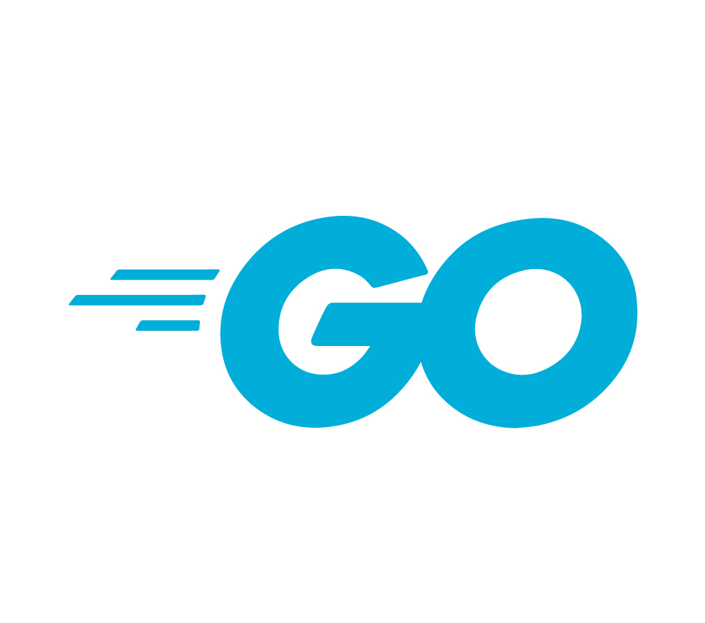

## Inhalt

* Idee
* Programmiersprache und Frameworks
* Prototyp
* Challanges
* Ausblick
* Acknowledgements
* Links

---

## Idee

----

Das Kernelement von jedem <span style="display: block;"></span>Geo-Informatik Projekt


<span style="font-size: 0.4em;">*Abbildung: Generiert mit - DALL-E*</span>

----

Möglichkeiten


<span style="font-size: 0.4em;">*Abbildung: Generiert mit - DALL-E*</span>

----

Das will ich auch können!


<span style="font-size: 0.4em;">*Abbildung: Generiert mit - DALL-E*</span>

----

WildTierSichtungsApp


<span style="font-size: 0.4em;">*Abbildung: Generiert mit - DALL-E*</span>

---

## Programmiersprache und Frameworks

----

### Frontend


<span style="font-size: 0.4em;">*Abbildung: von [https://github.com/ionic-team/](https://github.com/ionic-team/ionic-framework)*</span>

----

### Backend



<span style="font-size: 0.4em;">*Abbildung: [https://go.dev/blog/go-brand](https://go.dev/blog/go-brand)*</span>

----

### WebMap


<span style="font-size: 0.4em;">*Abbildung: [https://en.m.wikipedia.org/](https://en.m.wikipedia.org/wiki/File:Google_Maps_Logo_2020.svg)*</span>


----

### Datenbank


<span style="font-size: 0.4em;">*Abbildung: [https://github.com/mariadb-corporation](https://github.com/mariadb-corporation)*</span>

---

## Prototyp

----

Logo


<span style="font-size: 0.4em;">*Abbildung: Logo - Designed by Annalisa Berger*</span>

----

Datenbank Struktur


<span style="font-size: 0.4em;">*Abbildung: Kreiert mit DBeaver*</span>

----

QR Code um die App zu installieren
<br>


----

Demo

<div style="border: 1px solid black; padding: 1px; display: inline-block;">
    <iframe src="https://wildtierapp.juliankraft.ch/app/" width="95%" height="500px" allow="geolocation"></iframe>
</div>

----

Data View

<iframe src="https://wildtierapp.juliankraft.ch/inframe" width="100%" height="500px"></iframe>

----

Beispiel für Datenbezug mit Python:

```python
import mysql.connector
import json

# Load the database connection details from the JSON file
with open('./db_setup/db_config.json', 'r') as config_file:
    config = json.load(config_file)

# Connect to the MariaDB database
connection = mysql.connector.connect(
    host=config['host'],
    port=config['port'],
    user=config['user'],
    password=config['password'],
    database=config['database']
)

# Function to fetch data from the database
def get_data(statement):
    cursor = connection.cursor()
    try:
        cursor.execute(statement)
        data = cursor.fetchall()
        return data
    except mysql.connector.Error as e:
        print(f"Error fetching data: {e}")
    finally:
        cursor.close()

# Fetching data example

data = get_data("SELECT * FROM sichtungen;")


```

---

## Challanges

* Neue Programmiersprachen
* Neue Frameworks
* Server Konfiguration
* Datenbank Konfiguration
* Login und Authentifizierung

---

## Ausblick

Vom Prototyp zur Anwendung - was wäre noch nötig?

---

## Acknowledgements

Danke an Ramon Ott für die Unterstützung bei der Umsetung dieses Projekts.

Danke an Annalisa Berger für das Design des Logos.

---

## Links

Presentation:
* [wildtierapp.juliankraft.ch/presentation](https://wildtierapp.juliankraft.ch/presentation)

Prototyp:
* [WebApp - Installation](https://wildtierapp.juliankraft.ch/app/)
* [Datensichtung](https://wildtierapp.juliankraft.ch/)

GitHub Repos:
* [Frontend](https://github.com/juliankraft/WildtierSichtungsApp_front)
* [Backend](https://github.com/juliankraft/WildtierSichtungsApp_back)

